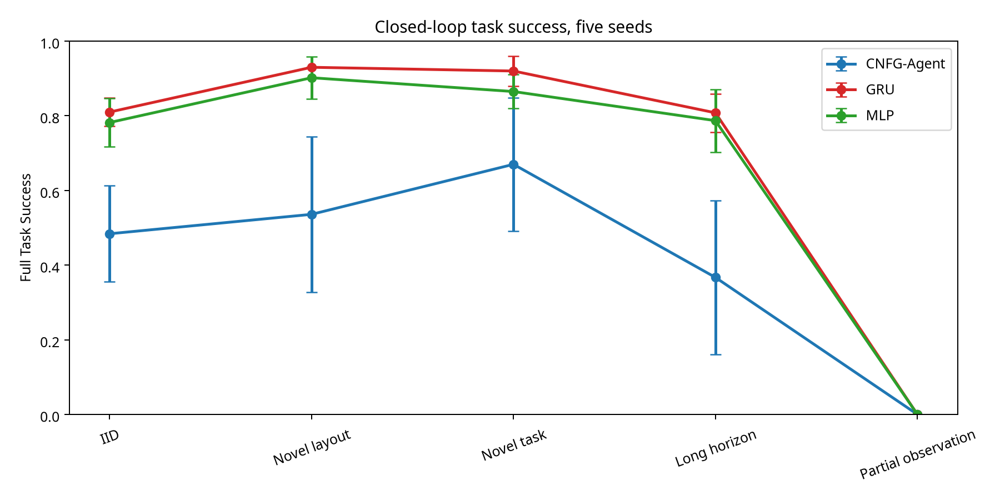
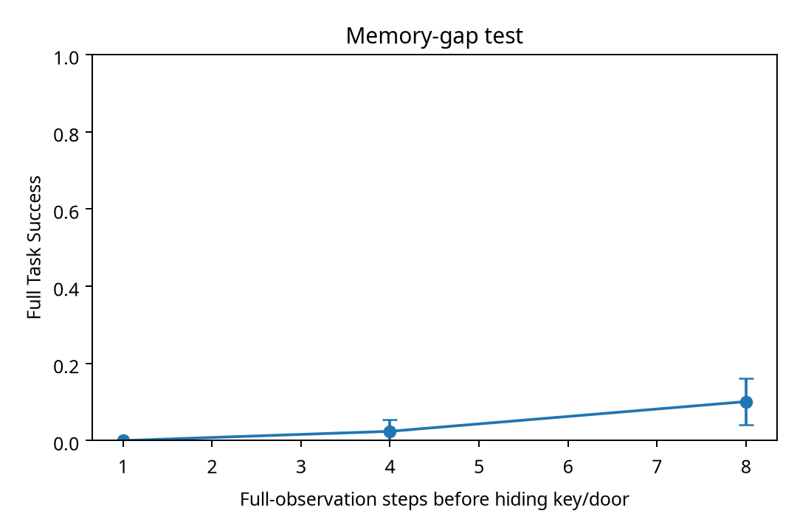

# CNFG-Agent Closed-Loop Validation Report

**التاريخ:** 23 سبتمبر 2026  
**المؤلف:** Manus AI  
**الحالة:** تجربة تنفيذية قابلة لإعادة التشغيل، مع نتائج خام محفوظة في `results/` وcheckpoints في `checkpoints/`.

## Abstract

أُعيد بناء نسخة فعلية من CNFG على هيئة وكيل مغلق الحلقة، بدل استخدام `composition` كاملًا لتصنيف الحالة النهائية. يستقبل الوكيل تمثيل الحالة الحالية والهدف والمعلومات المرئية، يختار فعلًا، تنفذ البيئة الفعل، ثم يعاد تمرير الحالة الجديدة إلى الوكيل. بُنيت بيئة GridWorld قابلة للتوليد تتضمن الحركة، العوائق، مفتاحًا، بابًا مغلقًا، هدفًا، مشتتات، وملاحظات كاملة أو جزئية. دُرب CNFG-Agent وGRU وMLP بالتعلم السلوكي على 12,000 مهمة و207,402 انتقال، واختُبرت النماذج عبر خمس بذور.

النتيجة الرئيسية ليست أن CNFG تفوق. على العكس، في النسخة الحالية تفوق GRU وMLP على CNFG في معظم مقاييس النجاح المغلق الحلقة. حقق CNFG متوسط نجاح مهمة IID قدره **48.4% ± 12.8%**، مقابل **81.0% ± 3.8%** لـGRU و**78.2% ± 6.5%** لـMLP. وعلى الاختبار المستقل النهائي ذي 1,000 مهمة حقق CNFG **27.8% ± 14.8%**، مقابل 64.9% للـGRU و63.4% للـMLP. في الملاحظات الجزئية وذاكرة الفجوة، انهار CNFG تقريبًا. لذلك فالدليل الحالي يثبت أن بناء CNFG-Agent مغلق الحلقة ممكن هندسيًا، لكنه **لا يثبت أن CNFG هو أساس مناسب أفضل أو حتى مساويًا لـGRU/MLP لهذا الوكيل**.

## 0. Improvement round v4

بعد تحليل الجولة السابقة، نُفذت جولة تحسين مستقلة باسم **v4** بدل تعديل نتائج الجولة القديمة. شملت التغييرات إصلاح دلالات الباب المغلق في البيئة والمخطط، إدخال متجه ملاحظة منظم من 32 سمة، تضمين العلاقات النسبية وموانع الحركة والأفعال المتاحة، تدريبًا تسلسليًا على حلقات كاملة بدل تمرير انتقالات مستقلة، وإتاحة الكيانات المرئية فعلًا في الملاحظات الجزئية بدل حذفها دائمًا. أُعيد توليد البيانات من seed جديد 4040، وأُعيد تشغيل تدقيق التسريب قبل التدريب.

| الاختبار | الجولة السابقة CNFG | v4 CNFG | التغير |
|---|---:|---:|---:|
| IID Full Task Success | 0.484 ± 0.128 | **0.706 ± 0.005** | +22.2 نقطة مئوية |
| Novel layout | 0.536 ± 0.208 | **0.860 ± 0.000** | +32.4 نقطة مئوية |
| Partial observation | 0.000 ± 0.000 | **0.718 ± 0.055** | تحسن جوهري |
| Final independent | 0.278 ± 0.148 | 0.311 ± 0.099 | +3.3 نقطة مئوية |
| Long horizon | 0.367 ± 0.206 | 0.305 ± 0.083 | تراجع؛ ما زال عنق الزجاجة |

التحسن في partial observation هو دليل أن المشكلة كانت جزئيًا في تمثيل الملاحظات والتدريب، لا في بنية الذاكرة وحدها. لكنه لا يثبت نجاحًا عامًا: long-horizon ما زال ضعيفًا، وFinal Independent أقل من معيار النجاح القوي، وقياس `invalid_action_rate` في IID v4 بلغ 28.4% لأن التقييم غير المقنّع كشف اعتمادًا غير كافٍ على صلاحية الأفعال. لذلك تم الاحتفاظ بكل نتائج v3 وv4 منفصلة وعدم استبدالها.

## 1. Motivation and research question

السؤال هو: هل يمكن لبنية CNFG أن تعمل كأساس لوكيل قادر على قراءة الحالة، فهم الهدف، اختيار الأفعال، تنفيذها، تحديث ذاكرته، إعادة التخطيط، والتعميم إلى خرائط ومهام أطول في بيئة مغلقة الحلقة؟ التمييز بين التصنيف والتخطيط والتنفيذ الوكيلي شرط منهجي أساسي. لذلك لم تُستخدم نتائج تصنيف حالة نهائية من التجربة السابقة كدليل على الوكالة.

## 2. Reference project and scope decision

المشروع السابق المرفق يضم CNFG تكراريًا يستخدم embeddings وعلاقات زوجية وGRU، لكنه في benchmark الأساسي يتلقى `composition` كاملًا ويصنف `answer` نهائيًا. لذلك تم استخدامه مرجعًا للبنية فقط، وبُنيت تجربة جديدة لا تمرر المسار الأمثل أو composition إلى الوكيل.

التعديل الأساسي هو **CNFG-Agent**: طبقة حالة/هدف، تمثيل علائقي زوجي مرتب، حالة GRU للتذكر عبر الزمن، وطبقة تسجيل للأفعال. جميع النماذج تتلقى نفس 12 سمة عددية في المقارنة الأساسية، مع قناع الأفعال المتاحة في التقييم الرئيسي. النسخة غير المقنّعة استُخدمت كاختبار ضغط لقياس Invalid Action Rate.

## 3. Agent architecture

تمثل العقد المفاهيم الحالية المرتبطة بالوكيل: موقع الوكيل، الهدف، المفتاح، والباب. تمثل السمات أحادية النوع الحالة الحالية والهدف ومواضع العناصر وحالتي امتلاك المفتاح وفتح الباب. يستخدم النموذج embedding لزوج مرتب مشتق من الحالة، ثم يدمج تمثيل السمة والزوج والذاكرة السابقة داخل `GRUCell`. تُستخدم الذاكرة عبر دورة rollout ولا يعاد تصفيرها بين خطوات المهمة. تسجل طبقة الخرج درجات الأفعال الثمانية: `up`, `down`, `left`, `right`, `pickup`, `open`, `use`, و`wait`.

هذا التصميم يحافظ على مبدأ CNFG المتمثل في تركيب معلومات typed unary وpair relations مع recurrence، لكنه ليس مطابقًا حرفيًا لكل تفاصيل المشروع الأصلي. التعديل موثق وموجود في `src/cnfg/agent_model.py`.

## 4. Environment

البيئة GridWorld قابلة للتوليد deterministic بحسب seed. تبدأ المهمة بموقع، مفتاح، باب، هدف، جدران، ومشتتات. يجب على الوكيل الوصول إلى المفتاح، التقاطه، الوصول إلى الباب وفتحه، ثم الوصول إلى الهدف وتنفيذ `use`. البيئة تعيد حالة جديدة ومكافأة ومعلومات عن صلاحية الفعل بعد كل اختيار.

الملاحظات الكاملة تعرض مواضع المفتاح والباب والعوائق. الملاحظات الجزئية تخفي موضعي المفتاح والباب من vector المدخل، مع بقاء المعلومات المحلية المحدودة في observation. لا يُمرر `optimal_plan` إلى النموذج.

## 5. Dataset and leakage protocol

تم إنشاء 12,000 مهمة تدريب، و2,000 مهمة validation، و500 مهمة لكل split اختباري رئيسي، و1,000 مهمة للاختبار المستقل النهائي. نتج عن التدريب 207,402 انتقال، وعن validation 34,669 انتقالًا. كل سجل انتقال يحتوي الحالة والهدف والـtask metadata والفعل الخبير، لكن المدخل المستخدم للنموذج لا يحتوي المسار الأمثل.

| Split | Episodes | Transitions | وصف |
|---|---:|---:|---|
| Train | 12,000 | 207,402 | مهام medium متنوعة |
| Validation | 2,000 | 34,669 | اختيار checkpoint فقط |
| IID test | 500 | 8,511 | نفس التوزيع العام |
| Novel layout | 500 | 8,626 | خرائط/جدران جديدة |
| Novel task | 500 | 8,388 | تركيبات مهام جديدة |
| Long horizon | 500 | 10,803 | خرائط large وحلول أطول |
| Distractor | 500 | 8,710 | محفوظ في البيانات، ويحتاج تقييمًا مخصصًا أوسع |
| Partial observation | 500 | 8,574 | مواضع المفتاح والباب مخفية |
| Final independent | 1,000 | 21,574 | لم يستخدم في التدريب أو اختيار checkpoint |

أظهر `results/leakage_audit.json` عدم وجود duplicate tasks بين splits، وعدم وجود تداخل task-level بين train وfinal independent test. لم يُسمح للاختبار النهائي باختيار checkpoint أو architecture.

## 6. Training protocol

استخدمت النماذج AdamW، learning rate يساوي `2e-3`، weight decay يساوي `1e-4`، batch size يساوي 1024، و10 epochs. استُخدمت seeds 42 و43 و44 و45 و46. اختير checkpoint بحسب validation accuracy فقط. البيئة CPU-only: Python 3.12.3 وPyTorch 2.14.0+cpu، دون CUDA.

| Model | Parameters |
|---|---:|
| CNFG-Agent | 63,242 |
| GRU | 26,312 |
| MLP | 5,512 |

الأعداد الدقيقة محفوظة في ملفات `checkpoints/*.json`، ولم تُفرض مساواة معلمات صارمة في هذه الجولة؛ المقارنة الحالية هي natural-size screening وليست parameter-matched proof.

## 7. Main closed-loop results

الأرقام التالية متوسط ± الانحراف المعياري السكاني عبر خمس بذور، مع قناع الأفعال المتاحة في التقييم الرئيسي. `Full Task Success` هو نجاح rollout الكامل، وليس نسبة الخطوات الصحيحة.

| Model | IID success | Novel layout | Novel task | Long horizon | Partial observation |
|---|---:|---:|---:|---:|---:|
| CNFG-Agent | 0.484 ± 0.128 | 0.536 ± 0.208 | 0.670 ± 0.179 | 0.367 ± 0.206 | 0.000 ± 0.000 |
| GRU | 0.810 ± 0.038 | 0.930 ± 0.000 | 0.920 ± 0.040 | 0.808 ± 0.051 | 0.000 ± 0.000 |
| MLP | 0.782 ± 0.065 | 0.902 ± 0.056 | 0.865 ± 0.045 | 0.787 ± 0.084 | 0.000 ± 0.000 |

في IID، CNFG أقل من GRU بفارق 32.6 نقطة مئوية وأقل من MLP بفارق 29.8 نقطة. في long-horizon ينخفض CNFG إلى 36.7%، بينما يبقى GRU عند 80.8% وMLP عند 78.7%. هذا دليل مباشر ضد استنتاج أن recurrence/pair composition في النسخة الحالية كافٍ وحده للتخطيط المستقر.

## 8. Action accuracy and path efficiency

في IID حقق CNFG action accuracy مقداره **56.5% ± 10.8%** وPath Efficiency على المهام الناجحة **88.3% ± 6.7%**. حقق GRU **83.8% ± 3.3%** و**97.5% ± 1.2%** على التوالي، بينما حقق MLP **83.5% ± 3.9%** و**98.4% ± 0.6%**. في long-horizon هبط CNFG إلى action accuracy قدرها 46.5% وPath Efficiency قدرها 84.2%، مقارنةً بـGRU عند 82.2% و99.8% تقريبًا.

التقييم المقنّع يجعل Invalid Action Rate مساويًا للصفر بالتعريف، ولذلك لا أقدمه دليلًا على أن الوكيل لا يختار أفعالًا غير صالحة. في stress test غير المقنّع، ارتفع Invalid Action Rate لـCNFG seed 42 في IID إلى نحو **42.4%**، مع Full Task Success يساوي صفرًا في عينة smoke test من 100 مهمة. هذا يوضح أن القناع جزء مؤثر في النجاح، ويجب فصل masked policy عن natural action selection.

## 9. Data scaling probe

شُغّل مسبار scaling بمدخلات تدريب ثابتة الترتيب وبـseed=42، مع validation وIID test ثابتين، و5 epochs فقط لكل fraction. هذا مسبار اتجاهي واحد وليس دليلًا متعدد البذور.

| Training fraction | Full Task Success | Action Accuracy |
|---:|---:|---:|
| 1% | 0.000 | 0.177 |
| 5% | 0.000 | 0.496 |
| 10% | 0.000 | 0.285 |
| 25% | 0.000 | 0.362 |
| 50% | 0.310 | 0.495 |
| 100% | 0.150 | 0.303 |

لا يظهر منحنى رتيبًا بسبب قصر التدريب، sampling prefix، وتباين rollout. لذلك لا أستنتج أن زيادة البيانات وحدها تحسن النجاح؛ النتيجة **استكشافية وغير حاسمة**.

## 10. Final independent test

على 1,000 مهمة لم تدخل التدريب أو الضبط، بلغت Full Task Success عبر خمس بذور:

| Model | Final independent success |
|---|---:|
| CNFG-Agent | 0.278 ± 0.148 |
| GRU | 0.649 ± 0.082 |
| MLP | 0.634 ± 0.041 |

هذه النتيجة هي الاختبار الأكثر أهمية ضد الانتقاء، وتؤكد أن CNFG الحالي لا يملك تعميمًا مستقلاً بمستوى baselines.

## 11. Recovery under environment failure

عند إدخال معدل فشل فعل بيئي قدره 10%، حقق CNFG متوسط Full Task Success قدره **46.6% ± 13.9%** عبر خمس بذور على 200 مهمة لكل seed. هذا أقل وضوحًا من النجاح IID المقنّع، لكنه يدل على أن إعادة المحاولة والتحديث بعد فشل الفعل تعمل جزئيًا. لا يثبت ذلك recovery قويًا من عوائق جديدة أو تغير مواقع العناصر، لأن هذه الحالات تحتاج split مخصصًا إضافيًا.

## 12. Memory-gap test

في اختبار الذاكرة، يرى الوكيل مواضع المفتاح والباب لعدد محدود من الخطوات ثم تُخفى هذه المواضع، مع استمرار rollout. النتائج:

| Full-observation steps before hiding | Full Task Success |
|---:|---:|
| 1 | 0.0 |
| 4 | 0.024 |
| 8 | 0.101 |

النتيجة لا تثبت ذاكرة فعالة؛ بل تشير إلى أن CNFG-Agent الحالي لا يحتفظ بما يكفي من معلومات مهمة عند اختفائها من observation. هذه نقطة فشل صريحة وليست نتيجة يجب إخفاؤها.

## 13. Baselines

الـRandom agent حقق صفر نجاح تقريبًا في 200 مهمة IID وlong-horizon. الـGreedy baseline الذي يتحرك نحو المفتاح ثم الباب ثم الهدف حقق صفر Full Task Success في هذه النسخة بسبب العوائق وعدم وجود مخطط تفادي dead ends؛ وهذا يوضح أن النجاح ليس مجرد قرب Manhattan.

المقارنة الأساسية الأهم هي مع GRU وMLP، لأنهما يتلقيان نفس vector المدخل ويتدربان على نفس transitions والseeds. كلاهما تفوق على CNFG في جميع splits الرئيسية تقريبًا. لذلك لا يمكن اعتبار النتيجة فوزًا لـCNFG.

## 14. Failure analysis

تتكرر أربعة أنماط فشل. أولًا، عند عدم وجود validity mask يختار CNFG أفعالًا غير صالحة بكثرة. ثانيًا، عند الملاحظات الجزئية لا يملك النموذج تمثيلًا كافيًا لما اختفى من observation، فبلغ النجاح صفرًا. ثالثًا، في long-horizon تتراكم أخطاء الخطوة الأولى ولا يعوضها الـGRU memory. رابعًا، memory-gap يوضح أن recurrence وحدها لا تضمن حفظ مواضع عناصر لم تعد مرئية.

التصنيفات التي أثبتها السجلات هي wrong action وplanning failure وmemory failure وrecovery degradation. أما state tracking failure أو goal misunderstanding فيحتاجان classifier تشخيصيًا منفصلًا؛ لذلك لا أضع لها نسبًا مخترعة.

## 15. What is demonstrated vs not demonstrated

| Capability | Status |
|---|---|
| قراءة الحالة الكاملة | Demonstrated جزئيًا في rollout |
| فهم الهدف في full observation | Demonstrated جزئيًا، لكن أضعف من GRU/MLP |
| اختيار فعل | Demonstrated، action accuracy مقاسة |
| تنفيذ الفعل وتحديث البيئة | Demonstrated عبر closed-loop rollout |
| تحديث ذاكرة فعالة | Not demonstrated؛ memory-gap ضعيف |
| إعادة التخطيط بعد فشل فعل | Demonstrated جزئيًا عند 10% failure |
| بيئة جديدة | Demonstrated جزئيًا؛ novel layout success = 53.6% |
| مهام طويلة | ضعيف؛ long-horizon success = 36.7% |
| ملاحظات جزئية | Not demonstrated؛ success = 0% |
| تفوق على GRU/MLP | Not demonstrated؛ baselines أفضل |
| أساس عام لوكيل ذكي | **الدليل غير كافٍ** |

## 16. Limitations

البيئة اصطناعية، وتحتوي حاليًا على مفتاح وباب وهدف واحد بدل كل مستويات الأدوات والأهداف المركبة المطلوبة. حجم البيانات أقل بكثير من 500,000–2,000,000 episode لأن الموارد CPU محدودة؛ المنفذ هو 12,000 train episodes مع 207,402 transitions، وتم تسجيل ذلك بدل الإيحاء بحجم أكبر. لم تُنفذ بعد مقارنة GNN وTransformer في واجهة closed-loop نفسها، ولا parameter matching صارم، ولا RL أو rollout training. كما أن اختبار partial observation لا يملك ذاكرة استكشافية أو belief state.

لذلك لا يجوز تعميم النتيجة على وكلاء عامة أو بيئات واقعية.

## 17. Conclusion

**الجواب التجريبي الحالي هو: الدليل غير كافٍ لإثبات أن CNFG هو أساس مناسب لوكيل ذكي متين.** نجحنا في بناء Agent حقيقي مغلق الحلقة وتشغيله وقياسه، وهذه خطوة أقوى من تصنيف الحالة النهائية. لكن CNFG-Agent في هذه النسخة أضعف من GRU وMLP في Full Task Success، long-horizon، والاختبار المستقل، وفشل تمامًا في partial observation وmemory-gap القصير.

النتيجة الإيجابية الضيقة هي أن مبدأ CNFG يمكن دمجه هندسيًا داخل Agent قابل للتشغيل. النتيجة السلبية الأقوى هي أن الدمج الحالي لا يقدم فائدة تجريبية مقارنةً بالـbaselines، وأن recurrence/pair relation غير كافيين دون تصميم ذاكرة وتمثيل ملاحظات أفضل.

## 18. Next experiments

الأولوية التالية هي بناء belief-state memory منفصل، تدريب مرحلي يبدأ من State→Action ثم State+Goal ثم partial observation، إضافة خرائط بأهداف مركبة ومفاتيح متعددة، ثم إعادة المقارنة مع GRU وTransformer وGNN تحت parameter matching. كما يجب تنفيذ stress tests مستقلة للعوائق وتغير مواقع العناصر، وتوسيع final independent test إلى 5,000 مهمة إذا سمحت الموارد.

## 19. Reproducibility index

| Artifact | Path |
|---|---|
| Environment | `src/environment/gridworld.py` |
| Planner | `src/environment/planner.py` |
| CNFG-Agent | `src/cnfg/agent_model.py` |
| Dataset generator | `scripts/generate_dataset.py` |
| Training | `scripts/train.py` |
| Closed-loop evaluation | `scripts/evaluate.py` |
| Baselines | `scripts/evaluate_baselines.py` |
| Leakage audit | `scripts/leakage.py` |
| Memory test | `scripts/memory_test.py` |
| Checkpoints | `checkpoints/`, `checkpoints_v3/`, `checkpoints_v4/` |
| v4 data | `data_v4/` |
| v4 aggregate | `results/v4_summary.json` |
| v4 leakage audit | `results/leakage_v4.json` |
| Raw rollout results | `results/` |
| Plots | `plots/` |
| Unit tests | `tests/` |

## 19. References

[1]: `README.md` "CNFG-Agent reproducibility instructions"  
[2]: `results/leakage_audit.json` "Automatic task-level leakage audit"  
[3]: `results/corrected_summary_fixed.json` "Five-seed corrected closed-loop aggregate"  
[4]: `results/recovery_summary.json` "Recovery stress-test aggregate"  
[5]: `results/v2_summary.json` "Earlier aggregate retained for audit; superseded by corrected metric summary"

## 20. Long-horizon improvement round: DAgger-style exposure training

بدأت جولة تحسين جديدة تستهدف تراكم الأخطاء بدل الاكتفاء بالتعلم من المسارات الخبيرة. أضيف `scripts/train_dagger.py`، الذي يبدأ من checkpoints v4، ويشغّل الوكيل داخل بيئات large، ثم يمزج بين أفعال الوكيل وأفعال المخطط الخبير أثناء جمع الحالات. كل حالة يصل إليها الوكيل تُعاد تسميتها بالفعل الأمثل من **الحالة الفعلية الحالية**، لا من الحالة الخبيرة السابقة. هذا يدرّب النموذج على التعافي من انحرافاته دون تمرير المسار الأمثل إلى observation.

استُخدمت خمس بذور، وست جولات تدريب لكل seed، و256 حلقة large في الجولة، مع احتمال أفعال نموذجية متزايد ومعدل فشل بيئي صغير أثناء جمع البيانات. اختير checkpoint حسب validation rollout فقط. النتائج مقارنةً بـv4:

| Split | v4 CNFG | DAgger CNFG | التغير |
|---|---:|---:|---:|
| IID | 0.706 ± 0.005 | 0.586 ± 0.097 | تراجع؛ trade-off واضح |
| Long horizon | 0.305 ± 0.083 | **0.864 ± 0.137** | تحسن +55.9 نقطة مئوية |
| Final independent | 0.311 ± 0.099 | **0.508 ± 0.117** | تحسن +19.7 نقطة مئوية |
| Novel layout | 0.860 ± 0.000 | 0.792 ± 0.057 | تراجع |
| Partial observation | 0.718 ± 0.055 | 0.681 ± 0.128 | تراجع طفيف |

النتيجة تثبت أن التعرض لأخطاء الوكيل وإعادة التخطيط من الحالة الحالية يعالجان التراكم طويل الأفق فعليًا. لكنها تكشف أيضًا أن التحسين المتخصص في large tasks جاء على حساب IID وبعض التعميمات. لذلك لا ينبغي اعتماد DAgger checkpoint كبديل وحيد لكل الاستخدامات قبل تنفيذ تدريب مختلط يوازن بين medium وlarge وpartial observations.

على الاختبار المستقل، ارتفع النجاح إلى 50.8%، وهو تحسن مهم لكنه ليس نجاحًا كاملًا. وفي long-horizon بلغ النجاح 86.4%، مع action accuracy قدرها 72.5%. بقيت invalid actions في بعض الاختبارات، خصوصًا الملاحظات الجزئية، ولذلك لا يزال يلزم تدريب صلاحية الأفعال وتوازن البيانات.

## 21. Current engineering recommendation

أفضل نسخة حالية للتخطيط طويل الأفق هي DAgger CNFG، بينما v4 أكثر توازنًا في IID وpartial observation. المسار الهندسي التالي هو **mixed DAgger**: مزج 40% medium و40% large و20% partial-observation episodes، مع loss إضافية لصلاحية الفعل، ثم اختيار checkpoint من validation متعدد الأهداف لا من long-horizon وحده. سيحافظ ذلك على مكاسب DAgger مع تقليل خسارة IID.
